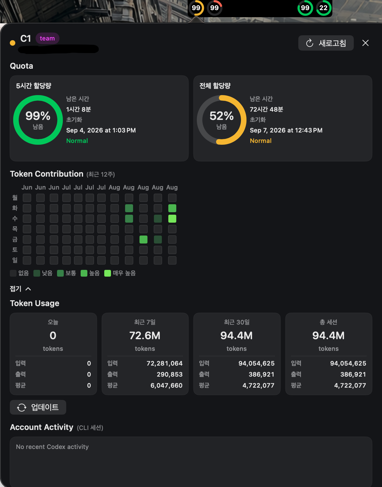

# Codex Quota Monitor

- macOS 메뉴 막대·노치용 Codex 계정 사용량 확인 앱



## 주요 기능

### 사용량 UI

- 메뉴 막대·노치에서 최대 4개 Codex 계정의 남은 할당량 확인
- 중앙 숫자: 5시간 할당량 잔여율 / 외곽 링: 주간 할당량 잔여율
- 계정 클릭 시 상세 화면에서 두 할당량·초기화 시각·남은 시간 확인

### CLI 세션

- 터미널에서 실행한 Codex 작업의 최근 활동 확인
- 계정별 세션 제목·상태 표시 및 활동 알림

### 토큰 사용량

- Codex CLI가 로컬에 저장한 세션 기록(`CODEX_HOME/sessions`)의 토큰 정보 집계
- 서버 실시간 조회가 아닌 로컬 기록 기준
- 최근 12주 일별 사용량을 잔디 형태로 표시
- 오늘·최근 7일·최근 30일의 입력·출력 토큰 확인
- 업데이트 버튼으로 사용량 다시 조회

### 설정

- 개인 로컬 환경에 맞는 계정별 경로 지정
- 자동 새로고침 주기·활동 알림 표시 시간·계정 라벨 표시 설정
- macOS 로그인 시 자동 실행 설정

## 계정 설정과 요구 사항

- 최대 4개 계정 등록
- 개인 로컬 환경에 맞게 Settings에서 계정별 `CODEX_HOME` 설정
- macOS 14 이상, Swift tools 6.0 지원 환경
- 별도 설치·로그인한 실행 가능한 Codex CLI 필요

## 빌드·테스트·패키징

- 저장소 루트에서 실행

```bash
swift build
swift test
scripts/package_app.sh --output /path/to/CodexQuotaMonitor.app --configuration release
```

- 로컬 실행용 앱 패키징·임시 서명 제공
- 배포용 서명·공증 미제공

## 폴더 구조

```text
.
├── Sources/
│   ├── CodexQuotaMonitorApp/    앱 실행·기능 연결
│   └── CodexQuotaMonitorKit/    핵심 기능
│       ├── Account/            계정 설정·할당량 상태 관리
│       ├── Codex/              Codex CLI 연동·할당량 조회
│       ├── Notch/              노치 패널 배치
│       ├── Probe/              Ping 요청·결과 처리
│       ├── Service/            설정 저장·새로고침·자동 실행
│       ├── Session/            CLI 세션 조회·활동 알림
│       ├── UI/                 사용량·상세 화면·설정 UI
│       └── Usage/              로컬 토큰 집계·메모리 캐시
├── Tests/                      기능별 자동 테스트
├── resource/                   앱 정보(Info.plist)·README 이미지
├── scripts/                    앱 패키징 스크립트
├── Package.swift               Swift 빌드·테스트 구성
├── README.md                   프로젝트 안내
└── LICENSE                     MIT 라이선스
```

- 로컬 전용: `docs/` 문서·`codex/` 작업 기록·`.build/` 빌드 결과 — Git 배포 제외

## 알려진 오류

- Ping 실행 버튼: 즉시 `1` 전송 기능 미작동
- 토큰 사용량 잔디: 캐시 영구 저장 미지원, 앱 재실행 시 초기화

## 주의 사항

- OpenAI와 무관한 비공식 독립 프로젝트
- Codex CLI·인증정보·서명 키·인증서·DMG 미포함

## 라이선스

- [MIT](LICENSE)
